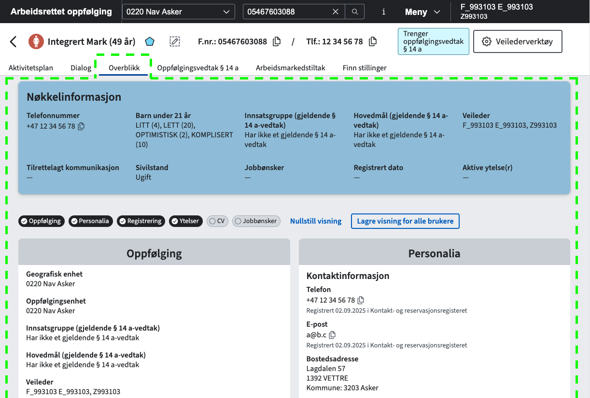

# Veilarbdetaljerfs / Overblikk

Klientapplikasjon i Modia arbeidsrettet oppfølging som gir et overblikk over informasjon om en bruker under oppfølging. 

Applikasjonen ble startet som en del av et sommerprosjekt for studenter i Team OBO 2023, og erstattet det som den gangen het Detaljer. Nå heter den Overblikk, selv om repo-navn henger litt etter.

Testversjon av løsningen: https://navikt.github.io/veilarbdetaljerfs/



## Komme i gang
### Installere pakker

For å kunne hente ned @navikt/arbeidssokerregisteret-utils må du legge til en `.npmrc` fil i homemappen med følgende innhold:

```shell
//npm.pkg.github.com/:_authToken=TOKEN
@navikt:registry=https://npm.pkg.github.com
```
[Se navikt/frontend](https://github.com/navikt/frontend?tab=readme-ov-file#installere-pakker-lokalt) for å se hvordan du kan generere et token på GitHub.

### Kjøre opp applikasjonen lokalt:

```shell
npm run dev
```

### Bygge applikasjonen:

```shell
npm run build
```

---

## Henvendelser

Spørsmål knyttet til koden eller prosjektet kan stilles som issues her på GitHub.

### For Nav-ansatte

Interne henvendelser kan sendes via Slack i kanalen [#team-obo-poao](https://nav-it.slack.com/archives/C02G0292ULW).

### Kode generert av GitHub Copilot

Dette repoet bruker GitHub Copilot til å generere kode.
